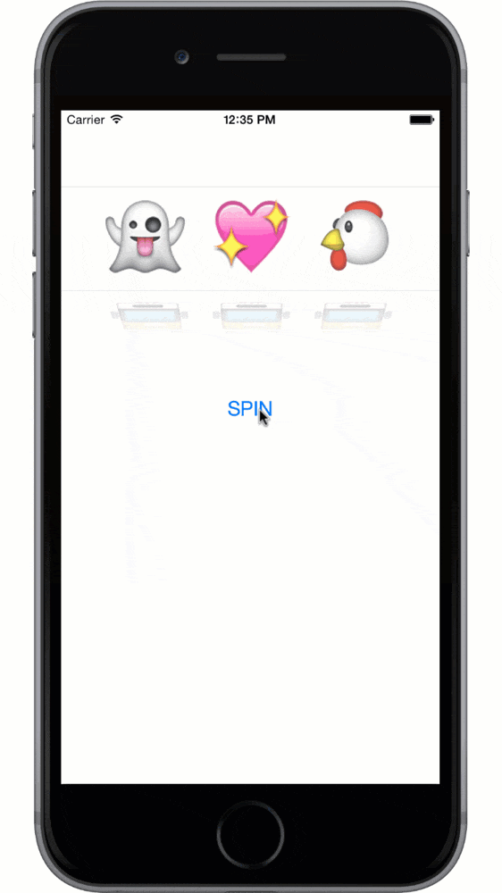

# SlotMachine
##旋轉吧！使用UIPickerView元件與Emoji繪文字打造拉霸機App
###在iOS程式中，UIPickerView通過滾輪界面提供單項或多值選項。這篇Swift教學會為你介紹UIPickerView元件，透過打造一個Emoji拉霸機App，你將會透徹瞭解如何使用UIPickerView。

## Where I learn? You can do it absolutely.
learn from raywenderlish, add auto layout by myself.  
step by step with the tutorial below.  
* [旋轉吧！使用UIPickerView元件與Emoji繪文字打造拉霸機App](http://www.appcoda.com.tw/uipickerview-tutorial/?utm_source=sendy&utm_medium=email&utm_campaign=uipickerview-intro) [APPCODA]

## The result pictures show.

   
